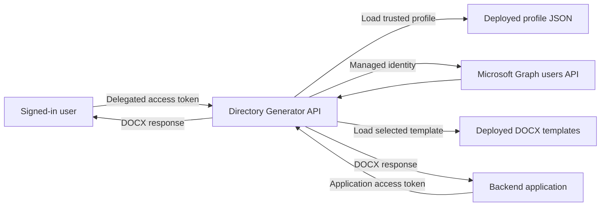
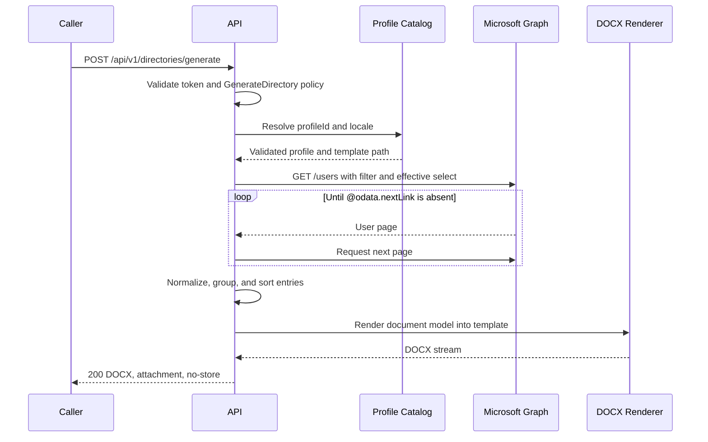

# Directory Generator Architecture and Development Plan

## 1. Purpose

Directory Generator is a single-tenant ASP.NET Core Web API that:

1. Authenticates and authorizes Microsoft Entra users and applications.
2. Uses the Azure App Service managed identity to read users from Microsoft Graph.
3. Applies a deployed directory profile that defines the population, properties, ordering, and Word template.
4. Generates a localized Microsoft Word phone book.
5. Returns the generated DOCX directly to the caller.

This document is the proposed architecture and implementation sequence for review before development begins.

## 2. Goals

- Provide a small, maintainable API informed by, but independent from, the prior prototype.
- Secure every business endpoint with Microsoft Entra ID.
- Support explicitly authorized delegated users and applications through assigned Entra app roles.
- Use secretless app-only access from Azure App Service to Microsoft Graph.
- Keep directory definitions version-controlled and independently configurable.
- Make Word templates approachable for non-developers to edit.
- Support English Canada and French Canada output.
- Generate documents synchronously unless testing demonstrates that a job model is necessary.
- Avoid storing or caching directory data and generated documents for now. This may change in future versions based on performance testing and user feedback.

## 3. Non-Goals for V1

- A web-based profile or template editor.
- Runtime template uploads.
- Caller-supplied Graph filters or projections.
- Multi-tenant operation.
- Profile photos.
- Generated-document persistence.
- Directory data caching.
- A dedicated health endpoint.
- A custom application concurrency limiter.
- A fixed application-level generation timeout.
- Porting the layout algorithm or project structure from the prior prototype.

## 4. Key Decisions

| Area | Decision |
| --- | --- |
| Runtime | .NET 10 and ASP.NET Core controllers |
| Solution shape | One production API project and one test project |
| Tenant model | Single Microsoft Entra tenant |
| User callers | Delegated token plus assigned Entra application role |
| Application callers | Application token plus assigned Entra application role |
| API authorization | One `GenerateDirectory` policy requires the generation role for both caller types |
| Graph identity | Azure App Service managed identity |
| Graph permission | Microsoft Graph application permission `User.Read.All` |
| Graph caller context | App-only; caller tokens are not forwarded to Graph |
| Profile storage | Trusted JSON files deployed with the API |
| Profile filter | Trusted OData filter expression, validated at startup |
| Template storage | Macro-free DOCX files deployed with the API |
| Template language | Small Handlebars-like token set inside DOCX templates |
| Localization | Locale selected per request: `en-CA` or `fr-CA` |
| Delivery model | Synchronous DOCX response initially |
| Scale fallback | Move to an asynchronous event/job model only if testing requires it |
| Data persistence | None |

## 5. System Context



## 6. Request Flow



The entire flow receives the request cancellation token. A caller disconnect should stop Graph paging and prevent unnecessary rendering work where possible.

## 7. Identity and Authorization

### 7.1 Inbound API Identity

Create a single-tenant API app registration that exposes:

- A delegated scope, tentatively `Directory.Access`, used only to request a user access token.
- An application role, tentatively `Directory.Generate`, allowed for both users/groups and applications.

The API uses `Microsoft.Identity.Web` JWT bearer authentication. A single authorization policy named `GenerateDirectory` succeeds only when the validated token contains the `Directory.Generate` value in its `roles` claim. This requirement applies equally to delegated user tokens and application tokens.

- Users receive access only through direct app-role assignment or membership in an assigned group.
- Applications receive access only through app-role assignment to their service principal.
- Possessing a valid token or the delegated scope alone does not authorize generation.

Authentication alone is insufficient. All business endpoints require this policy.

### 7.2 Swagger Identity

Swagger UI uses a separate single-tenant public-client app registration with authorization code flow and PKCE. It requests the delegated API scope, but the signed-in user must also have the `Directory.Generate` app role.

Swagger is a development and integration aid, not the identity used to call Microsoft Graph.

### 7.3 Outbound Graph Identity

The Azure App Service managed identity calls Microsoft Graph with application permission `User.Read.All` and the `.default` scope.

- No Graph client secret is stored by the application.
- The caller's access token is never forwarded to Graph.
- Every authorized caller sees the same profile-defined directory population.
- Graph permissions are independent of the API caller's delegated Graph permissions.

For local development, the Graph credential remains replaceable through `TokenCredential`. The local credential approach will be documented during implementation and must not add credentials to source control.

## 8. API Contract

### 8.1 List Profiles

```http
GET /api/v1/profiles
Authorization: Bearer {token}
```

Returns safe profile metadata:

```json
[
  {
    "id": "hq-by-department",
    "displayName": "HQ directory by department",
    "supportedLocales": ["en-CA", "fr-CA"]
  }
]
```

It does not expose raw filters, selected properties, or physical template paths.

### 8.2 Generate Directory

```http
POST /api/v1/directories/generate
Authorization: Bearer {token}
Content-Type: application/json
```

```json
{
  "profileId": "hq-by-department",
  "locale": "en-CA"
}
```

Successful response:

- Status: `200 OK`
- Content type: `application/vnd.openxmlformats-officedocument.wordprocessingml.document`
- Content disposition: attachment with a server-generated safe filename
- Cache control: `no-store`

Expected failures use Problem Details and do not include Graph payloads, access tokens, profile internals, or directory values.

## 9. Directory Profile

The directory profile is the central configuration abstraction. It defines four concerns:

1. Who belongs in the directory.
2. Which Graph properties are retrieved.
3. How entries are grouped and sorted.
4. Which localized Word template renders the result.

Example:

```json
{
  "id": "hq-by-department",
  "displayNames": {
    "en-CA": "HQ directory by department",
    "fr-CA": "Repertoire du siege social par service"
  },
  "filter": "officeLocation eq 'HQ' and accountEnabled eq true and userType eq 'Member'",
  "properties": [
    "displayName",
    "givenName",
    "surname",
    "jobTitle",
    "department",
    "companyName",
    "officeLocation",
    "businessPhones",
    "mobilePhone",
    "mail",
    "userPrincipalName",
    "onPremisesExtensionAttributes"
  ],
  "sort": {
    "groupBy": {
      "property": "department",
      "direction": "ascending"
    },
    "entries": [
      {
        "property": "surname",
        "direction": "ascending"
      },
      {
        "property": "givenName",
        "direction": "ascending"
      },
      {
        "property": "displayName",
        "direction": "ascending"
      }
    ]
  },
  "templates": {
    "en-CA": "Templates/hq-by-department.en-CA.docx",
    "fr-CA": "Templates/hq-by-department.fr-CA.docx"
  }
}
```

### 9.1 Filter Rules

The filter value is the OData filter expression only, without `$filter=`.

Raw OData is acceptable here because profiles are trusted, version-controlled deployment artifacts and cannot be supplied or changed by API callers. The profile loader must still reject:

- URLs or resource paths.
- Additional query parameters such as `$select`, `$expand`, `$top`, or `$skip`.
- Control characters.
- Empty filters unless a profile explicitly supports the full enabled-member population.

Graph remains fixed to the `/users` collection.

### 9.2 Effective Property Projection

The Graph projection is calculated rather than copied directly from one field:

```text
effective properties =
    profile properties
  + filter dependencies
  + grouping properties
  + sorting properties
  + template token properties
  + application-required identity/fallback properties
```

Duplicates are removed before creating the Graph request.

`extensionAttribute1` through `extensionAttribute15` are represented by Graph under `onPremisesExtensionAttributes`. The profile selects the parent Graph property; the renderer may expose friendly token aliases such as `{{extensionAttribute14}}`.

### 9.3 Sorting

Grouping and sorting occur in the application after all pages are read. This produces deterministic output and avoids depending on Graph ordering support for every property combination.

- Comparisons use the requested locale where appropriate.
- Missing structured names fall back to `displayName`.
- A stable final tie-breaker such as `userPrincipalName` or Graph user ID prevents nondeterministic ordering.
- Missing group values use a localized fallback group or an explicit profile rule.

### 9.4 Startup Validation

The application fails startup when any deployed profile is invalid. Validation includes:

- Unique, URL-safe profile ID.
- Supported localized display names.
- Valid supported locale keys.
- Non-empty and structurally safe filter.
- Approved Graph properties.
- Group and sort properties included in the effective projection.
- Supported sort direction.
- Existing template file for every declared locale.
- Valid template package and required structural markers.
- Known template tokens.

This moves profile mistakes from request time to deployment time.

## 10. Document Model

Graph SDK objects do not flow directly into the renderer. The application maps them to a small, null-safe document model.

Representative entry fields:

- `displayName`
- `givenName`
- `surname`
- `jobTitle`
- `department`
- `companyName`
- `officeLocation`
- `businessPhones`
- `mobilePhone`
- `mail`
- `userPrincipalName`
- `extensionAttribute1` through `extensionAttribute15` when selected

Normalization rules:

- Missing optional values render as blank.
- Email may fall back from `mail` to `userPrincipalName`.
- Business phone values are preserved and joined with line breaks.
- Phone strings are not reformatted.
- Invalid optional values become blank without dropping the whole entry.
- Structural failures, invalid profiles, and invalid templates fail the request.

## 11. Word Template Model

### 11.1 Authoring Experience

Templates are ordinary macro-free DOCX files. Template authors place familiar tokens directly in document text and table cells:

```text
{{documentTitle}}
{{generatedAt}}
{{entryCount}}
{{displayName}}
{{jobTitle}}
{{department}}
{{businessPhones}}
{{mail}}
```

V1 intentionally supports a small token language, not the full Handlebars language.

Supported behavior:

- Scalar token replacement.
- One repeatable prototype entry row.
- One optional repeatable group section for grouped profiles.
- Blank output for missing optional values.
- Line breaks for multi-valued fields such as `businessPhones`.

Not supported in V1:

- Arbitrary expressions or code execution.
- Dynamic property access.
- General nested loops.
- Includes or remote templates.
- HTML or raw Open XML insertion.
- User-defined helpers.

### 11.2 Structural Markers

Visible tokens are convenient for values but unreliable as the only structural mechanism because Word can split text across XML runs. Use a hybrid approach:

- Handlebars-like tokens identify values.
- A Word content control tagged `dg:entries` identifies the prototype entry row.
- A Word content control tagged `dg:groups` identifies a repeatable group section when grouping is configured.

The renderer must detect value tokens even when Word splits them across multiple runs. Replacement preserves the formatting of the containing prototype element.

### 11.3 Template Security and Validation

Templates are trusted deployment artifacts but are still inspected before use. Reject:

- Macro-enabled Word documents.
- External relationships.
- Embedded active content.
- Missing or duplicate required structural markers.
- Unknown tokens.
- Tokens that cannot be resolved from document metadata or the effective profile properties.

Generated values are written as Open XML text only, never interpreted as XML.

## 12. Microsoft Graph Integration

- Use the Microsoft Graph .NET SDK and a `GraphServiceClient` backed by `TokenCredential`.
- Use `https://graph.microsoft.com/.default` for app-only authentication.
- Request up to the users endpoint's supported page size.
- Follow every `@odata.nextLink` until exhausted.
- Preserve required headers such as `ConsistencyLevel: eventual` on subsequent pages when a profile filter requires advanced query behavior.
- Honor `Retry-After` for Graph throttling and use bounded retry behavior for transient failures.
- Propagate cancellation through every page request.
- Never log access tokens, Graph response bodies, or directory field values.

The first implementation should fetch all matching pages before sorting and rendering. Streaming optimization is premature because global grouping and sorting require the complete eligible result set.

## 13. Synchronous Delivery and Scale Decision

V1 generates and returns the DOCX within the initiating HTTP request.

We will not introduce an arbitrary user-count limit before measuring the implementation. Instead, development testing will use representative directory sizes, template complexity, and concurrent requests to observe:

- Total request duration.
- Graph retrieval duration and page count.
- Rendering duration.
- Peak process memory.
- Generated document size.
- Behavior when callers cancel requests.
- Behavior under simultaneous generation requests.

If synchronous generation operates within acceptable App Service and client request behavior, it remains the production model.

If testing reveals unacceptable duration, memory pressure, platform timeout behavior, or concurrency degradation, the API contract evolves to an asynchronous job model:

```http
POST /api/v1/directory-jobs
GET  /api/v1/directory-jobs/{jobId}
GET  /api/v1/directory-jobs/{jobId}/document
```

That change would add a queue or event transport, worker, job state, temporary document storage, expiration, and authorization for job ownership. Those components are deliberately deferred until measurements justify them.

## 14. Error Handling

Use RFC 7807 Problem Details with stable application error codes.

Expected categories:

- Invalid request.
- Unknown profile.
- Unsupported locale.
- Unauthorized caller.
- Forbidden caller.
- Invalid deployed profile or template.
- Microsoft Graph unavailable or throttled beyond retry policy.
- Document generation failure.
- Request cancelled.

Responses include a correlation or trace ID. They do not expose exceptions, Graph request URLs containing filters, tenant directory data, or internal filesystem paths.

## 15. Logging and Privacy

Record metadata only:

- Correlation/trace ID.
- Caller object or application ID.
- Caller type: delegated user or application.
- Profile ID.
- Locale.
- Graph page count.
- Eligible entry count.
- Retrieval and rendering duration.
- Output byte size.
- Outcome and safe error category.

Do not log:

- Access or identity tokens.
- Request authorization headers.
- Names, titles, phone numbers, emails, departments, or other user properties.
- Graph response bodies.
- Generated document contents.
- Raw exception details in client responses.

Generated responses use `Cache-Control: no-store`.

## 16. Proposed Source Structure

```text
DirectoryGenerator.sln
.gitignore
src/
  DirectoryGenerator.Api/
    Auth/
    Contracts/
    Controllers/
    Directory/
      Models/
      Profiles/
      Sorting/
    Graph/
    Documents/
    Profiles/
      hq-alphabetical.json
      hq-by-department.json
    Templates/
      hq-alphabetical.en-CA.docx
      hq-alphabetical.fr-CA.docx
      hq-by-department.en-CA.docx
      hq-by-department.fr-CA.docx
    Program.cs
    appsettings.json
    appsettings.Development.json
tests/
  DirectoryGenerator.Api.Tests/
docs/
  architecture-and-development-plan.md
```

Folders organize responsibilities inside one production assembly. Introduce interfaces only at meaningful boundaries, especially Graph retrieval, profile loading, and document rendering.

`appsettings.json` is committed and contains only safe defaults or explicit placeholder values. `appsettings.Development.json` is a local override file excluded by `.gitignore`; it may contain developer-specific non-production settings but should still avoid secrets when .NET user secrets or environment variables can be used. Hosted environment overrides use App Service configuration. Credentials and client secrets are never committed.

## 17. Development Plan

### Phase 1: Solution Foundation

Deliverables:

- Create the .NET 10 solution, API project, and test project.
- Add controllers, OpenAPI, Problem Details, and baseline configuration validation.
- Add a committed `appsettings.json` with safe placeholder values and a git-ignored `appsettings.Development.json` for local overrides.
- Add central package management only if it reduces real duplication.
- Keep the new solution independent from the prior prototype implementation.

Verification:

- Clean restore and build.
- Empty test suite executes successfully.
- API starts locally with no Graph or Azure operation required.

### Phase 2: Inbound Security

Deliverables:

- Add `Microsoft.Identity.Web` JWT bearer authentication.
- Configure single-tenant issuer and audience validation.
- Implement the `GenerateDirectory` policy to require the `Directory.Generate` app role for delegated users and applications.
- Protect profile and generation endpoints.
- Configure Swagger OAuth authorization code flow with PKCE.

Verification:

- Missing token returns `401`.
- Valid token without generation permission returns `403`.
- A delegated token with the required app role authorizes the endpoint.
- An application token with the required app role authorizes the endpoint.
- A valid delegated scope without the required app role returns `403`.
- A valid application token without the required app role returns `403`.
- Wrong tenant, issuer, or audience is rejected.

### Phase 3: Profile Contract and Catalog

Deliverables:

- Define strongly typed profile models.
- Implement deployed JSON profile loading.
- Implement startup validation.
- Add initial alphabetical and by-department profile examples.
- Implement `GET /api/v1/profiles` with localized safe metadata.

Verification:

- Invalid duplicate IDs, properties, locales, filters, sorting, and template paths fail startup tests.
- The profile endpoint never exposes filters or paths.
- Effective property calculation is deterministic.

### Phase 4: Graph Directory Reader

Deliverables:

- Configure `GraphServiceClient` with `TokenCredential`.
- Use managed identity in the Azure-hosted credential chain.
- Apply the profile filter and effective select.
- Implement complete paging, required header propagation, retry behavior, and cancellation.
- Map Graph users to the null-safe document model.

Verification:

- Multi-page responses return every matching user.
- Filters and selects are passed correctly.
- Advanced query headers survive page transitions.
- Throttled requests honor retry guidance.
- Cancellation stops paging.
- Logs contain no user values or tokens.

### Phase 5: Grouping and Sorting

Deliverables:

- Implement profile-driven grouping.
- Implement ordered sorting rules and stable tie-breakers.
- Apply locale-aware comparison where required.
- Implement null and fallback behavior.

Verification:

- Alphabetical output is deterministic.
- Department groups and entries are ordered correctly.
- Missing surname, given name, department, and display name behave as specified.
- English and French comparison behavior is covered with representative data.

### Phase 6: DOCX Template Renderer

Deliverables:

- Create macro-free English and French starter templates.
- Define the supported token catalog.
- Implement token discovery across split Open XML runs.
- Implement scalar replacement.
- Clone the entry prototype row and optional group prototype section.
- Validate templates and relationships.
- Produce a valid in-memory DOCX stream.

Verification:

- Open XML validation succeeds.
- Generated documents open in Word-compatible readers.
- Tokens split across runs are replaced.
- Unknown tokens and invalid structures fail clearly.
- Formatting and table geometry remain owned by the template.
- Multi-valued phones render with line breaks.

### Phase 7: Generation Endpoint

Deliverables:

- Implement `POST /api/v1/directories/generate`.
- Orchestrate profile resolution, Graph retrieval, sorting, rendering, and response.
- Add safe localized filenames and `Cache-Control: no-store`.
- Add metadata-only audit logging and duration measurements.

Verification:

- Both locales produce the correct template.
- Unknown profile and locale return Problem Details.
- DOCX response headers are correct.
- Caller cancellation is propagated.
- No partial document is returned after a failure.

### Phase 8: Representative Scale Testing

Deliverables:

- Build generated Graph fixtures covering small and realistically large directories.
- Measure duration, memory, output size, and concurrent request behavior.
- Test representative templates rather than synthetic empty documents.
- Document observed operating characteristics.

Decision gate:

- Keep synchronous delivery when measured behavior is acceptable.
- Design the asynchronous event/job extension only when measurements show a concrete need.

### Phase 9: Deployment Readiness Documentation

Deliverables:

- Document required API app registration settings.
- Document the token-acquisition scope and the required app-role assignments for users/groups and applications.
- Document the separate Swagger client registration.
- Document App Service managed identity and Graph `User.Read.All` admin consent.
- Document non-secret application settings.
- Document smoke-test steps and operational diagnostics.

No Azure deployment or Azure-changing command is part of this development plan unless separately requested and performed by the user.

## 18. Test Strategy

### Unit Tests

- Profile parsing and validation.
- Effective property projection.
- Filter safety checks.
- Grouping and sorting.
- Null normalization and fallback rules.
- Token discovery and replacement.
- Template structural validation.
- Authorization policy claim interpretation.

### Component Tests

- Graph paging with a fake HTTP pipeline or request adapter.
- Retry and cancellation behavior.
- DOCX generation from real test templates.
- Open XML package validation.
- Controller responses and headers.
- Problem Details mapping.
- Log redaction.

### Integration Tests

- In-memory ASP.NET Core host.
- Delegated and application claim scenarios with and without the required app role.
- End-to-end profile-to-DOCX flow with a fake Graph boundary.
- English and French output.

Live Microsoft Graph calls are not required for the normal automated test suite.

## 19. Acceptance Criteria for V1

- Every business endpoint rejects unauthenticated and unauthorized callers.
- Only delegated users and applications assigned the `Directory.Generate` app role can invoke generation through the same policy.
- Production Graph access uses the App Service managed identity with no client secret.
- API callers cannot supply or alter Graph filters, projections, sorting, or templates.
- Profiles define filter, properties, sorting/grouping, and localized templates.
- Invalid profiles and templates fail during startup validation.
- Graph pagination retrieves the complete matching result set.
- The generated directory uses deterministic profile-driven ordering.
- English Canada and French Canada templates produce valid DOCX files.
- Template authors can use documented `{{propertyName}}` tokens.
- The API returns the DOCX synchronously with attachment and no-store headers.
- Cancellation propagates through the request.
- Logs contain operational metadata but no directory values, tokens, or document contents.
- Representative scale tests are completed before confirming the production delivery model.

## 20. Deferred Decisions

The following should be resolved from implementation evidence or customer content, not guessed now:

- Exact initial profile filters and tenant-specific non-person account exclusions.
- Final template visual design and localized wording.
- The local developer credential workflow.
- Whether advanced Graph filters require `ConsistencyLevel: eventual` and `$count=true` for the chosen profiles.
- Acceptable duration, memory, output size, and concurrency targets.
- Whether scale testing justifies an asynchronous event/job architecture.

## 21. References

- Microsoft Identity Web overview: https://learn.microsoft.com/entra/msidweb/overview
- Protected ASP.NET Core web API: https://learn.microsoft.com/entra/identity-platform/scenario-protected-web-api-app-configuration
- Microsoft Graph list users: https://learn.microsoft.com/graph/api/user-list?view=graph-rest-1.0
- Microsoft Graph SDK paging: https://learn.microsoft.com/graph/sdks/paging
- Open XML SDK: https://learn.microsoft.com/office/open-xml/open-xml-sdk
